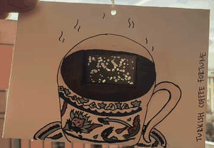

## Turkish Coffee ESP32 Display - Module 1 ##

## Project Summary

This project is a generative art piece on a LilyGo TTGO T-Display ESP32 inspired by *fal*, the Turkish tradition of reading fortunes in coffee grounds. The display becomes the inside of a coffee cup where foam bubbles form and pop, the cup flips, and the grounds settle into random splotches that reveal a moon (Success) or a star (Luck), so no two cups ever look the same.

Link to blog: [blog post](https://ceydat709.github.io/coms3930-design-documentation/modules/module-1.html)

## Project GIF

## Source Code & Installation Instructions
To recreate this project, you will need:

Hardware:
- LilyGo TTGO T-Display ESP32
- USB-C cable 
- LiPo battery (optional to run without USB-C cable)

Other (decoration): 
- Paper Envelope
- Markers
- Tape
- String
- Popsicle stick

### Setup
1. Download the Arduino IDE [here](https://www.arduino.cc/en/software)
2. Install the ESP32 boards by following the instructions [here](https://docs.espressif.com/projects/arduino-esp32/en/latest/installing.html) 
3. In Arduino, open the Library Manager and install `TFT_eSPI` by Bodmer
    1. Go to Tools > Manage Libraries
    2. Search for `TFT_eSPI` and install
4. Open the file `Arduino/libraries/TFT_eSPI/User_Setup_Select.h`
5. Comment out the line `#include <User_Setup.h>`
6. Uncomment the line `#include <User_Setups/Setup25_TTGO_T_Display.h>`

### Install
1. Clone the GitHub repository
2. Open `turkish_coffee_fal/turkish_coffee_fal.ino` in the Arduino IDE (if you want this display)
3. Plug in your TTGO T-Display with the USB-C cable
4. Go to Tools > Board > esp32 and select `ESP32 Dev Module`
5. Go to Tools > Port and select the port your board is on
6. Click Upload to upload the sketch to your TTGO T-Display

### Presentation
For the class installation, the board was taped to a paper envelope and a LiPo battery plugged into the JST port on the back.

## References / Acknowledgments
- [TFT_eSPI](https://github.com/Bodmer/TFT_eSPI) library by Bodmer
- Math used for the shapes
    - Moon: a point is inside a circle when `(x - cx)² + (y - cy)² < r²`, based on the [Pythagorean theorem / Euclidean distance](https://en.wikipedia.org/wiki/Euclidean_distance)
    - Star: a point is inside a diamond when `|x| / a + |y| / b < 1`, based on [taxicab (Manhattan) distance](https://en.wikipedia.org/wiki/Taxicab_geometry)
    - Splotches: grounds are drawn with a [random walk](https://en.wikipedia.org/wiki/Random_walk)
